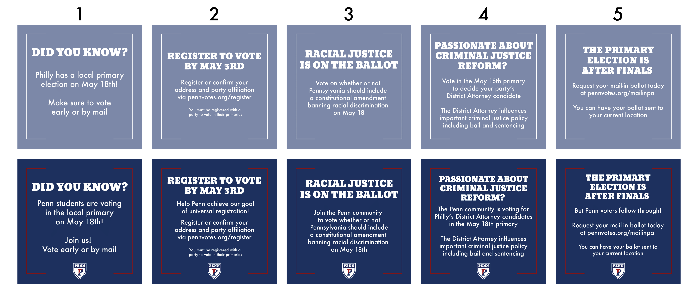

```{r setup, include=FALSE}
knitr::opts_chunk$set(echo = TRUE, message = FALSE, warning = FALSE, fig.path = "figs/week4/")

options(scipen = 999)
```


```{r}
# load packages
if (!require(pacman)) {
  install.packages("pacman")
}
pacman::p_load("tidyverse", "here", "tidytext", "ggwordcloud", "knitr", "reactable",
               install = TRUE)
# set aesthetics
palette = c("#b8b3be", "#357c92")
palette_messages = c("#1985a1", "#e64626", "#ffb800", "#4c5c68", "#00a896")

plot_aes = theme_minimal() +
  theme(legend.position = "top",
        legend.text = element_text(size = 12),
        text = element_text(size = 16, family = "Futura Medium"),
        axis.text = element_text(color = "black"),
        axis.line = element_line(colour = "black"),
        axis.ticks.y = element_blank())

# load the survey data file
data_sona = read_csv(here("static", "labs", "data", "survey_data_sona.csv"))
data_nonsona = read_csv(here("static", "labs", "data", "survey_data_nonsona.csv"))
merged = bind_rows(data_sona, data_nonsona)

item_text = merged %>%
  slice(1) %>%
  pivot_longer(cols = everything()) %>%
  mutate(text = ifelse(grepl("_[0-9]+|message_rating|school", name),
                         yes = gsub(".* - ", "", value),
                         no = value),
         text = gsub(" - Selected Choice", "", text),
         text = ifelse(grepl("student", name),
                       yes = gsub("In the next section.*Are", "Are", text),
                       no = text),
         text = gsub("\n", "", text),
         text = gsub(".*In your opinion, what", "In your opinion, what", text)) %>%
  select(-value) 

# tidy the survey data
data_tidy = merged %>%
  # filter out test and incomplete responses
  filter(!DistributionChannel == "preview" & Finished == 1 & consent == 1 & !source == "" & is.na(eligible)) %>%
  # pivot to long format
  pivot_longer(cols = -c(ResponseId, source, group)) %>%
  # join with item text
  left_join(., item_text) %>%
  # reverse and re-coding
  mutate(value = ifelse(name %in% c("identity_3"),
                        yes = 100 - as.numeric(value),
                        no = value),
         value = ifelse(name %in% c("election_2021"),
                        yes = recode(value, "1" = "Philadelphia",
                                     "2" = "Pennsylvania",
                                     "3" = "out of state: holding elections",
                                     "4" = "out of state: no elections",
                                     "5" = "not eligible to vote"),
                        no = value),
         value = ifelse(name %in% c("past_behav", "past_2020"),
                        yes = recode(value, "1" = "no",
                                     "2" = "yes",
                                     "3" = "not eligible"),
                        no = value),
          value = ifelse(grepl("checklist", name),
                        yes = recode(value, "2" = "0"),
                        no = value),
         value = ifelse(name %in% c("gender"),
                        yes = recode(value, "1" = "man",
                                     "2" = "non-binary / third gender",
                                     "3" = "woman",
                                     "4" = "prefer to self-describe",
                                     "5" = "prefer not to say"),
                        no = value),
          value = ifelse(name %in% c("hispanic_latinx"),
                        yes = recode(value, "1" = "yes",
                                     "0" = "no",
                                     "2" = "prefer not to say"),
                        no = value),
          value = ifelse(name %in% c("race"),
                        yes = recode(value, "1" = "American Indian or Alaska Native",
                                     "2" = "Asian",
                                     "3" = "Black or African American",
                                     "4" = "Native Hawaiian or other Pacific Islander",
                                     "5" = "White",
                                     "6" = "More than one race",
                                     "7" = "Prefer not to say"),
                        no = value),      
          value = ifelse(name %in% c("student_level"),
                        yes = recode(value, "1" = "undergraduate",
                                     "2" = "graduate",
                                     "3" = "not a student"),
                        no = value),
          value = ifelse(name %in% c("school_undergrad"),
                        yes = recode(value, "1" = "The Wharton School",
                                     "2" = "School of Arts & Sciences",
                                     "3" = "Penn Engineering",
                                     "4" = "Penn Nursing",
                                     "5" = "Other"),
                        no = value),
         #name = ifelse(name %in% c("motivation_2021_1", "motivation_2021_2"), "vote_motive_controlled", name),
         #name = ifelse(name %in% c("motivation_2021_3", "motivation_2021_4", "motivation_2021_5"), "vote_motive_autonomous", name),
         name = gsub("social_norms_voting_1", "norms students", name),
         name = gsub("social_norms_voting_2", "norms friends", name),
         name = gsub("social_norms_voting_3", "norms community", name),
         name = gsub("engagement_1", "engagement students", name),
         name = gsub("engagement_2", "engagement community", name),
         name = gsub("intention_", "intention ", name),
         name = gsub("mailin", "request ballot", name),
         source = gsub("SONA", "psych pool", source),
         source = gsub("classforum", "class forums", source),
         source = gsub("listserv", "PLTV mailing list", source),
         source = gsub("vol", "volunteer list", source)
         )

messages = data_tidy %>%
  filter(grepl("message_ratings", name)) %>%
  extract(col = name, into = c("item", "name"), "([0-9]{1})_(.*)") %>%
  mutate(name = gsub("message_ratings_e_|message_ratings_c_", "", name),
         name = recode(name, "1" = "relevance self", "2" = "relevance others",
                       "3" = "motivation self", "4" = "motivation others",
                       "5" = "share broadcast", "6" = "share narrowcast",
                       "7" = "check norms", "8" = "check identity"),
         value = as.numeric(value)) %>%
  filter(!is.na(value)) 
         
```

# sample information {.tabset}

`r nrow(data_tidy %>% select(ResponseId) %>% unique())` people have completed the survey so far. Let's take a look at the following demographic information to get a feel for who participated.

## source
```{r}
data_tidy %>%
  select(ResponseId, source) %>% 
  unique() %>%
  group_by(source) %>%
  mutate(order = n()) %>%
  ggplot(aes(x = reorder(source, order))) +
  geom_bar() +
  coord_flip() +
  labs(x = "") +
  plot_aes +
  theme(legend.position = "top")
```

## gender
`r data_tidy %>% select(name, text) %>% filter(grepl("gender$", name)) %>% unique() %>% kable()`

```{r}
data_tidy %>%
  filter(grepl("gender$", name)) %>%
  filter(!is.na(value)) %>%
  group_by(value) %>%
  mutate(order = n()) %>%
  ggplot(aes(x = reorder(value, order))) +
  geom_bar() +
  coord_flip() +
  labs(x = "") +
  plot_aes +
  theme(legend.position = "top")
```

## ethnicity 
`r data_tidy %>% select(name, text) %>% filter(grepl("hispanic_latinx", name)) %>% unique() %>% kable()`

```{r}
data_tidy %>%
  filter(grepl("hispanic_latinx", name)) %>%
  filter(!is.na(value)) %>%
  group_by(value) %>%
  mutate(order = n()) %>%
  ggplot(aes(x = reorder(value, order))) +
  geom_bar() +
  coord_flip() +
  labs(x = "") +
  plot_aes +
  theme(legend.position = "top")
```

## race 
`r data_tidy %>% select(name, text) %>% filter(grepl("race$", name)) %>% unique() %>% kable()`

```{r}
data_tidy %>%
  filter(grepl("race$", name)) %>%
  filter(!is.na(value)) %>%
  group_by(value) %>%
  mutate(order = n()) %>%
  ggplot(aes(x = reorder(value, order))) +
  geom_bar() +
  coord_flip() +
  labs(x = "") +
  plot_aes +
  theme(legend.position = "top")
```

## student information {.tabset}
### status
`r data_tidy %>% select(name, text) %>% filter(grepl("student_", name)) %>% unique() %>% kable()`

```{r}
data_tidy %>%
  filter(grepl("student_level", name)) %>%
  group_by(value) %>%
  mutate(order = n()) %>%
  ggplot(aes(x = reorder(value, order))) +
  geom_bar() +
  coord_flip() +
  labs(x = "") +
  plot_aes +
  theme(legend.position = "top")
```

### year 
`r data_tidy %>% select(name, text) %>% filter(grepl("student_grade", name)) %>% unique() %>% kable()`

```{r}
data_tidy %>%
  filter(!is.na(value)) %>%
  filter(grepl("student_grade", name)) %>%
  ggplot(aes(x = value)) +
  geom_bar() +
  labs(x = "") +
  plot_aes +
  theme(legend.position = "top")
```

### school

```{r}
data_tidy %>%
  filter(!is.na(value)) %>%
  filter(grepl("school_undergrad$", name)) %>%
  group_by(value) %>%
  mutate(order = n()) %>%
  ggplot(aes(x = reorder(value, order))) +
  geom_bar() +
  coord_flip() +
  labs(x = "") +
  plot_aes +
  theme(legend.position = "top")
```

## voting behavior {.tabset}
### past voting behavior {.tabset}
`r data_tidy %>% select(name, text) %>% filter(grepl("past_", name)) %>% unique() %>% kable()`

```{r}
data_tidy %>%
  filter(grepl("past_", name)) %>%
  filter(!is.na(value)) %>%
  mutate(name = ifelse(name == "past_2020", 
                       yes = "voted in 2020",
                       no = "voted previously")) %>%
  group_by(value) %>%
  mutate(order = n()) %>%
  ggplot(aes(x = reorder(value, order))) +
  geom_bar() +
  labs(x = "") +
  facet_grid(~name) +
  plot_aes +
  theme(legend.position = "top")
```

### 2021 voting eligibility

```{r}
data_tidy %>%
  filter(grepl("election_2021", name)) %>%
  filter(!is.na(value)) %>%
  group_by(value) %>%
  mutate(order = n()) %>%
  ggplot(aes(x = reorder(value, order))) +
  geom_bar() +
  coord_flip() +
  labs(x = "") +
  plot_aes +
  theme(legend.position = "top")
```

# message framing experiment
In the next section, we'll explore whether there is evidence that the experimentally framed messages were more effective than control messages.

Keep in mind that these are preliminary analyses with the sample we currently have and that as we recruit more participants, the uncertainty around the estimates will decrease and we can be more confident about our results.

## message-level DVs {.tabset}

First, let's see if there were differences between the experimental and control conditions for items that were rated for each message.

### manipulation checks {.tabset}

These two items were included to check to see if our experimental manipulation worked. If so, we should see that the experimental messages were clearly rated higher than the control messages.

`r messages %>% select(name, text) %>% filter(grepl("check", name)) %>% unique() %>% kable()`

#### distributions
```{r}
messages %>%
  filter(grepl("check", name)) %>%
  ggplot(aes(x = value, y = name, fill = group)) +
  ggridges::geom_density_ridges2(alpha = .5, color = NA) +
  labs(y = "") +
  scale_color_manual(values = palette) + 
  scale_fill_manual(values = palette) + 
  plot_aes
```

#### means
```{r}
messages %>%
  filter(grepl("check", name)) %>%
  group_by(ResponseId, group, name) %>%
  summarize(value = mean(value, na.rm = TRUE)) %>%
  ggplot(aes(x = name, y = value, fill = group)) +
  stat_summary(fun = "mean", geom = "bar", position = position_dodge(.9)) +
  stat_summary(fun.data = "mean_cl_boot", geom = "errorbar", width = 0,
               position = position_dodge(.9)) +
  labs(x = "") +
  scale_color_manual(values = palette) + 
  scale_fill_manual(values = palette) + 
  plot_aes +
  theme(legend.position = "top")
```

### relevance {.tabset}

The next items measure how self and socially relevant participants found the messages.

Does framing messages to emphasize Penn social norms and identity increase perceived relevance?

`r messages %>% select(name, text) %>% filter(grepl("relevance", name)) %>% unique() %>% kable()`

#### distributions
```{r}
messages %>%
  filter(grepl("relevance", name)) %>%
  ggplot(aes(x = value, y = name, fill = group)) +
  ggridges::geom_density_ridges2(alpha = .5, color = NA) +
  labs(y = "") +
  scale_color_manual(values = palette) + 
  scale_fill_manual(values = palette) + 
  plot_aes
```

#### means
```{r}
messages %>%
  filter(grepl("relevance", name)) %>%
  group_by(ResponseId, group, name) %>%
  summarize(value = mean(value, na.rm = TRUE)) %>%
  ggplot(aes(x = name, y = value, fill = group)) +
  stat_summary(fun = "mean", geom = "bar", position = position_dodge(.9)) +
  stat_summary(fun.data = "mean_cl_boot", geom = "errorbar", width = 0,
               position = position_dodge(.9)) +
  labs(x = "") +
  scale_color_manual(values = palette) + 
  scale_fill_manual(values = palette) + 
  plot_aes +
  theme(legend.position = "top")
```

### motivation {.tabset}

These items measure perceived voting motivation for oneself and others.

Does framing messages to emphasize Penn social norms and identity increase perceived motivation to vote?

`r messages %>% select(name, text) %>% filter(grepl("motivation", name)) %>% unique() %>% kable()`

#### distributions
```{r}
messages %>%
  filter(grepl("motiv", name)) %>%
  ggplot(aes(x = value, y = name, fill = group)) +
  ggridges::geom_density_ridges2(alpha = .5, color = NA) +
  labs(y = "") +
  scale_color_manual(values = palette) + 
  scale_fill_manual(values = palette) + 
  plot_aes
```

#### means
```{r}
messages %>%
  filter(grepl("motivation", name)) %>%
  group_by(ResponseId, group, name) %>%
  summarize(value = mean(value, na.rm = TRUE)) %>%
  ggplot(aes(x = name, y = value, fill = group)) +
  stat_summary(fun = "mean", geom = "bar", position = position_dodge(.9)) +
  stat_summary(fun.data = "mean_cl_boot", geom = "errorbar", width = 0,
               position = position_dodge(.9)) +
  labs(x = "") +
  scale_color_manual(values = palette) + 
  scale_fill_manual(values = palette) + 
  plot_aes +
  theme(legend.position = "top")
```

### sharing {.tabset}

The items measure intentions to share the message on social media (broadcast sharing) or directly with a friend (narrowcast sharing)

Does framing messages to emphasize Penn social norms and identity increase intentions to share?

`r messages %>% select(name, text) %>% filter(grepl("share", name)) %>% unique() %>% kable()`

#### distributions
```{r}
messages %>%
  filter(grepl("share", name)) %>%
  ggplot(aes(x = value, y = name, fill = group)) +
  ggridges::geom_density_ridges2(alpha = .5, color = NA) +
  labs(y = "") +
  scale_color_manual(values = palette) + 
  scale_fill_manual(values = palette) + 
  plot_aes
```

#### means
```{r}
messages %>%
  filter(grepl("share", name)) %>%
  group_by(ResponseId, group, name) %>%
  summarize(value = mean(value, na.rm = TRUE)) %>%
  ggplot(aes(x = name, y = value, fill = group)) +
  stat_summary(fun = "mean", geom = "bar", position = position_dodge(.9)) +
  stat_summary(fun.data = "mean_cl_boot", geom = "errorbar", width = 0,
               position = position_dodge(.9)) +
  scale_color_manual(values = palette) + 
  scale_fill_manual(values = palette) + 
  labs(x = "") +
  plot_aes +
  theme(legend.position = "top")
```

<br><br>

## person-level DVs {.tabset}
Next, let's see whether the messaging intervention was associated with the person-level dependent variables. 

### Penn identity {.tabset}

These items measure how strongly participants identify with Penn.

Does exposure to messages that emphasize Penn social norms and identity increase how strongly people identify with Penn?

`r data_tidy %>% select(name, text) %>% filter(grepl("identity", name)) %>% unique() %>% kable()`

#### distributions
```{r}
data_tidy %>%
  filter(grepl("identity", name)) %>%
  mutate(value = as.numeric(value)) %>%
  group_by(ResponseId, group) %>%
  summarize(value = mean(value, na.rm = TRUE)) %>%
  ggplot(aes(x = value, fill = group)) +
  geom_density(alpha = .5, color = NA) +
  scale_color_manual(values = palette) + 
  scale_fill_manual(values = palette) + 
  plot_aes
```

#### means
```{r}
data_tidy %>%
  filter(grepl("identity", name)) %>%
  mutate(value = as.numeric(value)) %>%
  group_by(ResponseId, group) %>%
  summarize(value = mean(value, na.rm = TRUE)) %>%
  ggplot(aes(x = group, y = value, fill = group)) +
  stat_summary(fun = "mean", geom = "bar", position = position_dodge(.9)) +
  stat_summary(fun.data = "mean_cl_boot", geom = "errorbar", width = 0, position = position_dodge(.9)) +
  scale_color_manual(values = palette) + 
  scale_fill_manual(values = palette) + 
  labs(x = "") +
  plot_aes +
  theme(legend.position = "none")
```

### social norms {.tabset}

These items measure perceived social norms about voting for different groups at Penn.

Does exposure to messages that emphasize Penn social norms and identity increase perceived social norms about voting?

`r data_tidy %>% select(name, text) %>% filter(grepl("norms", name)) %>% unique() %>% kable()`

#### distributions
```{r}
data_tidy %>%
  filter(grepl("norms", name)) %>%
  mutate(value = as.numeric(value)) %>%
  ggplot(aes(x = value, y = name, fill = group)) +
  ggridges::geom_density_ridges2(alpha = .5, color = NA) +
  scale_color_manual(values = palette) + 
  scale_fill_manual(values = palette) + 
  labs(y = "") +
  plot_aes
```

#### means
```{r}
data_tidy %>%
  filter(grepl("norms", name)) %>%
  mutate(value = as.numeric(value)) %>%
  ggplot(aes(x = name, y = value, fill = group)) +
  stat_summary(fun = "mean", geom = "bar", position = position_dodge(.9)) +
  stat_summary(fun.data = "mean_cl_boot", geom = "errorbar", width = 0, position = position_dodge(.9)) +
  scale_color_manual(values = palette) + 
  scale_fill_manual(values = palette) + 
  labs(x = "") +
  plot_aes +
  theme(legend.position = "top")
```

### engagement {.tabset}

These items measure perceived civic engagement for Penn students and the Penn community.

Does exposure to messages that emphasize Penn social norms and identity increase perceived civic engagement?

`r data_tidy %>% select(name, text) %>% filter(grepl("engagement", name)) %>% unique() %>% kable()`

#### distributions
```{r}
data_tidy %>%
  filter(grepl("engagement", name)) %>%
  mutate(value = as.numeric(value)) %>%
  ggplot(aes(x = value, y = name, fill = group)) +
  ggridges::geom_density_ridges2(alpha = .5, color = NA) +
  scale_color_manual(values = palette) + 
  scale_fill_manual(values = palette) + 
  labs(y = "") +
  plot_aes
```

#### means
```{r}
data_tidy %>%
  filter(grepl("engagement", name)) %>%
  mutate(value = as.numeric(value)) %>%
  ggplot(aes(x = name, y = value, fill = group)) +
  stat_summary(fun = "mean", geom = "bar", position = position_dodge(.9)) +
  stat_summary(fun.data = "mean_cl_boot", geom = "errorbar", width = 0, position = position_dodge(.9)) +
  scale_color_manual(values = palette) + 
  scale_fill_manual(values = palette) + 
  labs(x = "") +
  plot_aes +
  theme(legend.position = "top")
```

### social belonging {.tabset}

These items measure perceived social belonging associated with voting.

Does exposure to messages that emphasize Penn social norms and identity increase voting-related social belonging?

`r data_tidy %>% select(name, text) %>% filter(grepl("belonging_", name)) %>% unique() %>% kable()`

#### distributions
```{r}
data_tidy %>%
  filter(grepl("belonging_", name)) %>%
  mutate(value = as.numeric(value)) %>%
  group_by(ResponseId, group) %>%
  summarize(value = mean(value, na.rm = TRUE)) %>%
  ggplot(aes(x = value, fill = group)) +
  geom_density(alpha = .5, color = NA) +
  scale_color_manual(values = palette) + 
  scale_fill_manual(values = palette) + 
  plot_aes
```

#### means
```{r}
data_tidy %>%
  filter(grepl("belonging_", name)) %>%
  mutate(value = as.numeric(value)) %>%
  group_by(ResponseId, group) %>%
  summarize(value = mean(value, na.rm = TRUE)) %>%
  ggplot(aes(x = group, y = value, fill = group)) +
  stat_summary(fun = "mean", geom = "bar", position = position_dodge(.9)) +
  stat_summary(fun.data = "mean_cl_boot", geom = "errorbar", width = 0, position = position_dodge(.9))+
  scale_color_manual(values = palette) + 
  scale_fill_manual(values = palette) + 
  labs(x = "") +
  plot_aes +
  theme(legend.position = "none")
```

### civic engagement attitudes {.tabset}
These items measure general civic engagement attitudes.

Does exposure to messages that emphasize Penn social norms and identity increase civic engagement attitudes?

`r data_tidy %>% select(name, text) %>% filter(grepl("CE_attitude", name)) %>% unique() %>% kable()`

#### distributions
```{r}
data_tidy %>%
  filter(grepl("CE_attitude", name)) %>%
  mutate(value = as.numeric(value)) %>%
  group_by(ResponseId, group) %>%
  summarize(value = mean(value, na.rm = TRUE)) %>%
  ggplot(aes(x = value, fill = group)) +
  geom_density(alpha = .5, color = NA) + 
  scale_fill_manual(values = palette) + 
  plot_aes
```

#### means
```{r}
data_tidy %>%
  filter(grepl("CE_attitude", name)) %>%
  mutate(value = as.numeric(value)) %>%
  group_by(ResponseId, group) %>%
  summarize(value = mean(value, na.rm = TRUE)) %>%
  ggplot(aes(x = group, y = value, fill = group)) +
  stat_summary(fun = "mean", geom = "bar", position = position_dodge(.9)) +
  stat_summary(fun.data = "mean_cl_boot", geom = "errorbar", width = 0, position = position_dodge(.9)) + 
  scale_fill_manual(values = palette) + 
  coord_cartesian(ylim = c(1, 7)) +
  labs(x = "") +
  plot_aes +
  theme(legend.position = "none")
```

### voting attitudes {.tabset}

These items measure attitudes about voting in 2021 elections. Only participants who reported being eligible to vote in an election (N = `r nrow(data_tidy %>% filter(grepl("election_2021", name) & !grepl("no", value)))`) responded to these items.

Does exposure to messages that emphasize Penn social norms and identity strengthen civic engagement attitudes?

`r data_tidy %>% select(name, text) %>% filter(grepl("^attitude", name)) %>% unique() %>% kable()`

#### distributions
```{r}
data_tidy %>%
  filter(grepl("^attitude", name)) %>%
  mutate(value = as.numeric(value)) %>%
  group_by(ResponseId, group) %>%
  summarize(value = mean(value, na.rm = TRUE)) %>%
  ggplot(aes(x = value, fill = group)) +
  geom_density(alpha = .5, color = NA) +
  scale_color_manual(values = palette) + 
  scale_fill_manual(values = palette) + 
  plot_aes
```

#### means
```{r}
data_tidy %>%
  filter(grepl("^attitude", name)) %>%
  mutate(value = as.numeric(value)) %>%
  group_by(ResponseId, group) %>%
  summarize(value = mean(value, na.rm = TRUE)) %>%
  ggplot(aes(x = group, y = value, fill = group)) +
  stat_summary(fun = "mean", geom = "bar", position = position_dodge(.9)) +
  stat_summary(fun.data = "mean_cl_boot", geom = "errorbar", width = 0, position = position_dodge(.9))+
  scale_color_manual(values = palette) + 
  scale_fill_manual(values = palette) + 
  coord_cartesian(ylim = c(1, 7)) +
  labs(x = "") +
  plot_aes +
  theme(legend.position = "none")
```

### voting intentions {.tabset}
These items measure voting-related intentions in 2021 elections. Only participants who reported being eligible to vote in an election (N = `r nrow(data_tidy %>% filter(grepl("election_2021", name) & !grepl("no", value)))`) responded to these items.

Does exposure to messages that emphasize Penn social norms and identity increase intentions to vote in the 2021 elections?

`r data_tidy %>% select(name, text) %>% filter(grepl("intention|plan", name)) %>% unique() %>% kable()`

#### distributions
```{r}
data_tidy %>%
  filter(grepl("intention|plan", name)) %>%
  mutate(value = as.numeric(value)) %>%
  ggplot(aes(x = value, y = name, fill = group)) +
  ggridges::geom_density_ridges2(alpha = .5, color = NA) +
  scale_color_manual(values = palette) + 
  scale_fill_manual(values = palette) + 
  labs(y = "") +
  plot_aes
```

#### means
```{r, fig.width=8}
data_tidy %>%
  filter(grepl("intention|plan", name)) %>%
  mutate(value = as.numeric(value)) %>%
  ggplot(aes(x = name, y = value, fill = group)) +
  stat_summary(fun = "mean", geom = "bar", position = position_dodge(.9)) +
  stat_summary(fun.data = "mean_cl_boot", geom = "errorbar", width = 0, position = position_dodge(.9)) +
  scale_color_manual(values = palette) + 
  scale_fill_manual(values = palette) + 
  coord_cartesian(ylim = c(1, 7)) +
  labs(x = "") +
  plot_aes +
  theme(legend.position = "none")
```

### voting efficacy {.tabset}
These items measure perceived self-efficacy to vote in 2021 elections. Only participants who reported being eligible to vote in an election (N = `r nrow(data_tidy %>% filter(grepl("election_2021", name) & !grepl("no", value)))`) responded to these items.

Does exposure to messages that emphasize Penn social norms and identity increased perceived self-efficacy to vote?

`r data_tidy %>% select(name, text) %>% filter(grepl("PBC", name)) %>% unique() %>% kable()`

#### distributions
```{r, fig.width=8}
data_tidy %>%
  filter(grepl("PBC", name)) %>%
  mutate(value = as.numeric(value)) %>%
  group_by(ResponseId, group) %>%
  summarize(value = mean(value, na.rm = TRUE)) %>%
  ggplot(aes(x = value, fill = group)) +
  geom_density(alpha = .5, color = NA) +
  scale_color_manual(values = palette) + 
  scale_fill_manual(values = palette) + 
  plot_aes
```

#### means
```{r}
data_tidy %>%
  filter(grepl("PBC", name)) %>%
  mutate(value = as.numeric(value)) %>%
  group_by(ResponseId, group) %>%
  summarize(value = mean(value, na.rm = TRUE)) %>%
  ggplot(aes(x = group, y = value, fill = group)) +
  stat_summary(fun = "mean", geom = "bar", position = position_dodge(.9)) +
  stat_summary(fun.data = "mean_cl_boot", geom = "errorbar", width = 0, position = position_dodge(.9)) +
  scale_color_manual(values = palette) + 
  scale_fill_manual(values = palette) + 
  coord_cartesian(ylim = c(1, 7)) +
  labs(x = "") +
  plot_aes +
  theme(legend.position = "none")
```

# moderation {.tabset}
Let's look at whether individual differences are related to the effectiveness of the message framing experiment.

## Penn identity {.tabset}
Here, we'll see whether the effect of message framing condition differed for people who have weaker versus stronger Penn identities.

For the bar graphs, we'll define strong identities as being above the median, and weak identities being at or below the median.

```{r}
identity = data_tidy %>%
  filter(grepl("identity", name)) %>%
  mutate(value = as.numeric(value)) %>%
  group_by(ResponseId, group) %>%
  summarize(identity = mean(value, na.rm = TRUE)) %>%
  ungroup() %>%
  mutate(identity_split = ifelse(identity > median(identity, na.rm = TRUE), "strong", "weak")) 
```

### relevance {.tabset}

Do people who have weaker/stronger Penn identities perceive the messages as more relevant when they're in the experimental versus control group?

#### median split
```{r}
messages %>%
  filter(grepl("relevance", name)) %>%
  group_by(ResponseId, group, name) %>%
  summarize(value = mean(value, na.rm = TRUE)) %>%
  left_join(., identity) %>%
  ggplot(aes(x = name, y = value, fill = group)) +
  stat_summary(fun = "mean", geom = "bar", position = position_dodge(.9)) +
  stat_summary(fun.data = "mean_cl_boot", geom = "errorbar", width = 0,
               position = position_dodge(.9)) +
  facet_grid(~identity_split) +
  labs(x = "") +
  scale_color_manual(values = palette) + 
  scale_fill_manual(values = palette) + 
  plot_aes +
  theme(legend.position = "top")
```

#### continuous measure
```{r}
messages %>%
  filter(grepl("relevance", name)) %>%
  group_by(ResponseId, group, name) %>%
  summarize(value = mean(value, na.rm = TRUE)) %>%
  left_join(., identity) %>%
  filter(!is.na(identity)) %>%
  ggplot(aes(x = identity, y = value, color = group, fill = group)) +
  geom_point() +
  geom_smooth(method = "lm") +
  facet_grid(~name) +
  scale_color_manual(values = palette) + 
  scale_fill_manual(values = palette) + 
  plot_aes
```

### motivation {.tabset}
Do people who have weaker/stronger Penn identities perceive the messages as more motivating when they're in the experimental versus control group?

#### median split
```{r}
messages %>%
  filter(grepl("motivation", name)) %>%
  group_by(ResponseId, group, name) %>%
  summarize(value = mean(value, na.rm = TRUE)) %>%
  left_join(., identity) %>%
  ggplot(aes(x = name, y = value, fill = group)) +
  stat_summary(fun = "mean", geom = "bar", position = position_dodge(.9)) +
  stat_summary(fun.data = "mean_cl_boot", geom = "errorbar", width = 0,
               position = position_dodge(.9)) +
  facet_grid(~identity_split) +
  labs(x = "") +
  scale_color_manual(values = palette) + 
  scale_fill_manual(values = palette) + 
  plot_aes +
  theme(legend.position = "top")
```

#### continuous measure
```{r}
messages %>%
  filter(grepl("motivation", name)) %>%
  group_by(ResponseId, group, name) %>%
  summarize(value = mean(value, na.rm = TRUE)) %>%
  left_join(., identity) %>%
  filter(!is.na(identity)) %>%
  ggplot(aes(x = identity, y = value, color = group, fill = group)) +
  geom_point() +
  geom_smooth(method = "lm") +
  facet_grid(~name) +
  scale_color_manual(values = palette) + 
  scale_fill_manual(values = palette) + 
  plot_aes
```

### sharing {.tabset}
Do people who have weaker/stronger Penn identities have higher sharing intentions when they're in the experimental versus control group?

#### median split
```{r}
messages %>%
  filter(grepl("share", name)) %>%
  group_by(ResponseId, group, name) %>%
  summarize(value = mean(value, na.rm = TRUE)) %>%
  left_join(., identity) %>%
  ggplot(aes(x = name, y = value, fill = group)) +
  stat_summary(fun = "mean", geom = "bar", position = position_dodge(.9)) +
  stat_summary(fun.data = "mean_cl_boot", geom = "errorbar", width = 0,
               position = position_dodge(.9)) +
  facet_grid(~identity_split) +
  labs(x = "") +
  scale_color_manual(values = palette) + 
  scale_fill_manual(values = palette) + 
  plot_aes +
  theme(legend.position = "top")
```

#### continuous measure
```{r}
messages %>%
  filter(grepl("share", name)) %>%
  group_by(ResponseId, group, name) %>%
  summarize(value = mean(value, na.rm = TRUE)) %>%
  left_join(., identity) %>%
  filter(!is.na(identity)) %>%
  ggplot(aes(x = identity, y = value, color = group, fill = group)) +
  geom_point() +
  geom_smooth(method = "lm") +
  facet_grid(~name) +
  scale_color_manual(values = palette) + 
  scale_fill_manual(values = palette) + 
  plot_aes
```

## class year {.tabset}
Here, we'll see whether the effect of message framing condition differed as a function of class year.

```{r}
year = data_tidy %>%
  filter(grepl("grade", name)) %>%
  mutate(value = as.numeric(value)) %>%
  rename("year" = value) %>%
  select(ResponseId, year)
```

### relevance {.tabset}
Does the effect of message condition on perceived message relevance differ by class year?

#### median split
```{r, fig.width=13}
messages %>%
  filter(grepl("relevance", name)) %>%
  group_by(ResponseId, group, name) %>%
  summarize(value = mean(value, na.rm = TRUE)) %>%
  left_join(., year) %>%
  filter(!is.na(year)) %>%
  ggplot(aes(x = name, y = value, fill = group)) +
  stat_summary(fun = "mean", geom = "bar", position = position_dodge(.9)) +
  stat_summary(fun.data = "mean_cl_boot", geom = "errorbar", width = 0,
               position = position_dodge(.9)) +
  facet_grid(~year) +
  labs(x = "") +
  scale_color_manual(values = palette) + 
  scale_fill_manual(values = palette) + 
  plot_aes +
  theme(legend.position = "top")
```

#### continuous measure
```{r}
messages %>%
  filter(grepl("relevance", name)) %>%
  group_by(ResponseId, group, name) %>%
  summarize(value = mean(value, na.rm = TRUE)) %>%
  left_join(., year) %>%
  filter(!is.na(year)) %>%
  ggplot(aes(x = year, y = value, color = group, fill = group)) +
  geom_point() +
  geom_smooth(method = "lm") +
  facet_grid(~name) +
  scale_color_manual(values = palette) + 
  scale_fill_manual(values = palette) + 
  plot_aes
```

### motivation {.tabset}
Does the effect of message condition on perceived message motivation differ by class year?

#### median split
```{r, fig.width=13}
messages %>%
  filter(grepl("motivation", name)) %>%
  group_by(ResponseId, group, name) %>%
  summarize(value = mean(value, na.rm = TRUE)) %>%
  left_join(., year) %>%
  filter(!is.na(year)) %>%
  ggplot(aes(x = name, y = value, fill = group)) +
  stat_summary(fun = "mean", geom = "bar", position = position_dodge(.9)) +
  stat_summary(fun.data = "mean_cl_boot", geom = "errorbar", width = 0,
               position = position_dodge(.9)) +
  facet_grid(~year) +
  labs(x = "") +
  scale_color_manual(values = palette) + 
  scale_fill_manual(values = palette) + 
  plot_aes +
  theme(legend.position = "top")
```

#### continuous measure
```{r}
messages %>%
  filter(grepl("motivation", name)) %>%
  group_by(ResponseId, group, name) %>%
  summarize(value = mean(value, na.rm = TRUE)) %>%
  left_join(., year) %>%
  filter(!is.na(year)) %>%
  ggplot(aes(x = year, y = value, color = group, fill = group)) +
  geom_point() +
  geom_smooth(method = "lm") +
  facet_grid(~name) +
  scale_color_manual(values = palette) + 
  scale_fill_manual(values = palette) + 
  plot_aes
```

### sharing {.tabset}
Does the effect of message condition on message sharing intentions differ by class year?

#### median split
```{r, fig.width=13}
messages %>%
  filter(grepl("share", name)) %>%
  group_by(ResponseId, group, name) %>%
  summarize(value = mean(value, na.rm = TRUE)) %>%
  left_join(., year) %>%
  filter(!is.na(year)) %>%
  ggplot(aes(x = name, y = value, fill = group)) +
  stat_summary(fun = "mean", geom = "bar", position = position_dodge(.9)) +
  stat_summary(fun.data = "mean_cl_boot", geom = "errorbar", width = 0,
               position = position_dodge(.9)) +
  facet_grid(~year) +
  labs(x = "") +
  scale_color_manual(values = palette) + 
  scale_fill_manual(values = palette) + 
  plot_aes +
  theme(legend.position = "top")
```

#### continuous measure
```{r}
messages %>%
  filter(grepl("share", name)) %>%
  group_by(ResponseId, group, name) %>%
  summarize(value = mean(value, na.rm = TRUE)) %>%
  left_join(., year) %>%
  filter(!is.na(year)) %>%
  ggplot(aes(x = year, y = value, color = group, fill = group)) +
  geom_point() +
  geom_smooth(method = "lm") +
  facet_grid(~name) +
  scale_color_manual(values = palette) + 
  scale_fill_manual(values = palette) + 
  plot_aes
```

# message effectiveness {.tabset}
Overall, which messages were most effective?



## relevance {.tabset}
### distributions
```{r, fig.width=12, fig.height=6}
messages %>%
  filter(grepl("relevance", name)) %>%
  ggplot(aes(x = value, y = name, fill = item)) +
  ggridges::geom_density_ridges2(alpha = .2, color = NA, scale = .8) +
  facet_grid(~group) +
  labs(y = "") +
  scale_color_manual(values = palette_messages) + 
  scale_fill_manual(values = palette_messages) + 
  plot_aes
```

### means
```{r}
messages %>%
  filter(grepl("relevance", name)) %>%
  mutate(value = as.numeric(value)) %>%
  ggplot(aes(x = item, y = value, fill = group)) +
  stat_summary(fun = "mean", geom = "bar", position = position_dodge(.9)) +
  stat_summary(fun.data = "mean_cl_boot", geom = "errorbar", width = 0, position = position_dodge(.9)) + 
  scale_fill_manual(values = palette) + 
  facet_grid(~name) +
  labs(x = "") +
  plot_aes +
  theme(legend.position = "top")
```

## motivation {.tabset}
### distributions
```{r, fig.width=12, fig.height=6}
messages %>%
  filter(grepl("motivation", name)) %>%
  ggplot(aes(x = value, y = name, fill = item)) +
  ggridges::geom_density_ridges2(alpha = .2, color = NA, scale = .8) +
  facet_grid(~group) +
  labs(y = "") +
  scale_color_manual(values = palette_messages) + 
  scale_fill_manual(values = palette_messages) + 
  plot_aes
```

### means
```{r}
messages %>%
  filter(grepl("motivation", name)) %>%
  mutate(value = as.numeric(value)) %>%
  ggplot(aes(x = item, y = value, fill = group)) +
  stat_summary(fun = "mean", geom = "bar", position = position_dodge(.9)) +
  stat_summary(fun.data = "mean_cl_boot", geom = "errorbar", width = 0, position = position_dodge(.9)) + 
  scale_fill_manual(values = palette) + 
  facet_grid(~name) +
  labs(x = "") +
  plot_aes +
  theme(legend.position = "top")
```

## sharing {.tabset}
### distributions
```{r, fig.width=12, fig.height=6}
messages %>%
  filter(grepl("share", name)) %>%
  ggplot(aes(x = value, y = name, fill = item)) +
  ggridges::geom_density_ridges2(alpha = .2, color = NA, scale = .8) +
  facet_grid(~group) +
  labs(y = "") +
  scale_color_manual(values = palette_messages) + 
  scale_fill_manual(values = palette_messages) + 
  plot_aes
```

### means
```{r}
messages %>%
  filter(grepl("share", name)) %>%
  mutate(value = as.numeric(value)) %>%
  ggplot(aes(x = item, y = value, fill = group)) +
  stat_summary(fun = "mean", geom = "bar", position = position_dodge(.9)) +
  stat_summary(fun.data = "mean_cl_boot", geom = "errorbar", width = 0, position = position_dodge(.9)) + 
  scale_fill_manual(values = palette) + 
  facet_grid(~name) +
  labs(x = "") +
  plot_aes +
  theme(legend.position = "top")
```

# other individual difference measures
## civic engagement behavior {.tabset}
These items measure general civic engagement behavior.

How civically engaged are the participants and do the groups differ?

`r data_tidy %>% select(name, text) %>% filter(grepl("CE_checklist", name)) %>% unique() %>% kable()`

### distributions
```{r}
data_tidy %>%
  filter(grepl("CE_checklist", name)) %>%
  mutate(value = as.numeric(value)) %>%
  group_by(ResponseId, group) %>%
  summarize(value = sum(value, na.rm = TRUE)) %>%
  ggplot(aes(x = value, fill = group)) +
  geom_density(alpha = .5, color = NA) + 
  scale_fill_manual(values = palette) + 
  plot_aes
```

### means
```{r}
data_tidy %>%
  filter(grepl("CE_checklist", name)) %>%
  mutate(value = as.numeric(value)) %>%
  group_by(ResponseId, group) %>%
  summarize(value = sum(value, na.rm = TRUE)) %>%
  ggplot(aes(x = group, y = value, fill = group)) +
  stat_summary(fun = "mean", geom = "bar", position = position_dodge(.9)) +
  stat_summary(fun.data = "mean_cl_boot", geom = "errorbar", width = 0, position = position_dodge(.9)) + 
  scale_fill_manual(values = palette) + 
  labs(x = "") +
  plot_aes +
  theme(legend.position = "none")
```

# reasons for voting/not voting {.tabset}
Next, let's look at the reasons participants endorsed for voting and not voting.

```{r}
reasons = read_csv(here("static", "labs", "data", "week8_reasons.csv"))

data_reasons = data_tidy %>%
  # select relevant variables
  select(-text) %>%
  filter(grepl("reasons_yes$|reasons_no$", name)) %>%
  # split the selected responses and convert to a single row per response
  unnest_tokens(value, value, token = stringr::str_split, pattern = ",") %>%
  # convert to numeric to facilitate joining
  mutate(value = as.numeric(value)) %>%
  # join with text 
  left_join(., reasons) %>%
  # remove missing responses and "other" responses
  filter(!is.na(text)) %>%
  # get unique responses
  unique()
```

## not voting
This plot shows the number of participants that endorsed each reason for not voting. Written in responses to "other" are reported below.

`r data_tidy %>% select(name, text) %>% filter(grepl("reasons_no$", name)) %>% unique() %>% kable()`

```{r, fig.width=10}
data_reasons %>%
  filter(name == "reasons_no") %>%
  group_by(text) %>%
  mutate(n_responses = n()) %>%
  ggplot(aes(x = reorder(text, n_responses))) +
  geom_bar() +
  coord_flip() +
  labs(x = "", y = "\ncount") +
  plot_aes

data_tidy %>%
  select(-text) %>%
  filter(grepl("reasons_no_", name)) %>%
  filter(!is.na(value)) %>%
  select(value) %>%
  rename("other reasons" = value) %>%
  kable()
```

## voting
This plot shows the number of participants that endorsed each reason for voting. Written in responses to "other" are reported below.

`r data_tidy %>% select(name, text) %>% filter(grepl("reasons_yes$", name)) %>% unique() %>% kable()`

```{r, fig.width=10}
data_reasons %>%
  filter(name == "reasons_yes") %>%
  group_by(text) %>%
  mutate(n_responses = n()) %>%
  ggplot(aes(x = reorder(text, n_responses))) +
  geom_bar() +
  coord_flip() +
  labs(x = "", y = "\ncount") +
  plot_aes

data_tidy %>%
  select(-text) %>%
  filter(grepl("reasons_yes_", name)) %>%
  filter(!is.na(value)) %>%
  select(value) %>%
  rename("other reasons" = value) %>%
  kable()
```

# open-ended questions {.tabset}
Below are the responses to the open-ended questions about civic engagement.

## meaning
`r data_tidy %>% select(name, text) %>% filter(grepl("OE_meaning", name)) %>% unique() %>% kable()`

```{r}
data_tidy %>%
  filter(grepl("OE_meaning", name)) %>%
  filter(!value == "") %>%
  mutate(value = gsub("\n", ", ", value)) %>%
  select(value) %>%
  rename("text" = value) %>%
  reactable(striped = TRUE,
            filterable = TRUE)
```

## importance
`r data_tidy %>% select(name, text) %>% filter(grepl("OE_matter", name)) %>% unique() %>% kable()`

```{r}
data_tidy %>%
  filter(grepl("OE_matter", name)) %>%
  filter(!value == "") %>%
  mutate(value = gsub("\n", ", ", value)) %>%
  select(value) %>%
  rename("text" = value) %>%
  reactable(striped = TRUE,
            filterable = TRUE)
```

## belonging
`r data_tidy %>% select(name, text) %>% filter(grepl("OE_belonging", name)) %>% unique() %>% kable()`

```{r}
data_tidy %>%
  filter(grepl("OE_belonging", name)) %>%
  filter(!value == "") %>%
  mutate(value = gsub("\n", ", ", value)) %>%
  select(value) %>%
  rename("text" = value) %>%
  reactable(striped = TRUE,
            filterable = TRUE)
```

## support
`r data_tidy %>% select(name, text) %>% filter(grepl("OE_support", name)) %>% unique() %>% kable()`

```{r}
data_tidy %>%
  filter(grepl("OE_support", name)) %>%
  filter(!value == "") %>%
  mutate(value = gsub("\n", ", ", value)) %>%
  select(value) %>%
  rename("text" = value) %>%
  reactable(striped = TRUE,
            filterable = TRUE)
```
