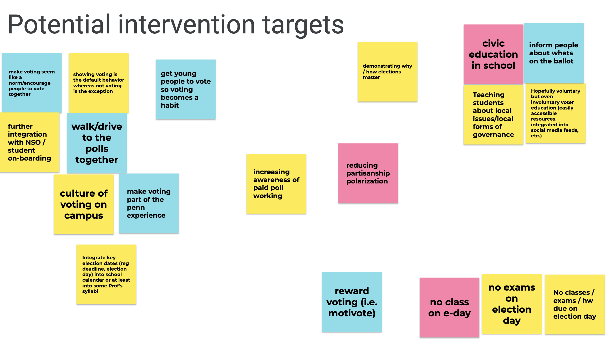

```{r setup, include=FALSE}
options(htmltools.dir.version = FALSE)
knitr::opts_chunk$set(warning = FALSE, message = FALSE, 
  comment = NA, dpi = 300,
  fig.align = "center", out.width = "80%", cache = FALSE)

if(!require('tidyverse')) {
	install.packages('tidyverse')
}
if(!require('devtools')) {
	install.packages('devtools') 
}
if(!require('emo')) {
	devtools::install_github("hadley/emo")
}
if(!require('xaringanExtra')) {
	devtools::install_github("gadenbuie/xaringanExtra")
}
if(!require('countdown')) {
	devtools::install_github("gadenbuie/countdown")
}
```

## Welcome! 

--

Introductions

* Name (& pronouns if you'd like to share)
* Year & Major
* Role in PLTV
* Experience with research and using R (or other programming languages)
* One thing you're excited to learn in this seminar
* One fun (alt: boring) fact about yourself

---

## Learning objectives

--

By the end of this seminar, you will be able to:

--

* Develop research questions related to your work with PLTV

--

* Identify ethical issues related to your research

--

* Test research questions using observational and experimental methods

--

* Design and implement surveys using Qualtrics

--

* Execute and modify scripts to tidy, analyze, and visualize data in R

--

* Summarize and interpret results

---
class: small

## Schedule

| Week | Date | Topic| Assignment |
| :--: | :--: | :--: | :--: |
| 1 | February 26 | Introduction & Asking Questions | +Develop a research question |
| 2 | March 5 | Experimentation | +Develop newsletter frames |
| 3 | *March 19 | Survey design | +Create a Qualtrics survey |
| 4 | March 26 | Data wrangling | Execute and modify R script |
| 5 | April 2 | Data visualization | Execute and modify R script |
| 6 | April 9 | Quantitative analysis | Execute and modify R script |
| 7 | April 16 | Text analysis | Execute and modify R script |
| 8 | April 23 | Summary, Synthesis, & Interpretation | +Generate HTML file summary |

<br>
\*No meeting March 12 (Spring Break)
<br>
\+Collaborative work

---
## Workflow

--

* Friday meetings
  * Provide background, context, and practical skills directly relevant to your research activities
  * Weekly "assignments" (collaborative research activities or coding activities in R)
  * Progress check-ins
  * Will be recorded for folks who can't be here (assuming folks are okay with this)

--

* Slack
  * Communicate about assignments during the week
  * Get and give feedback on assignments
  * Collective troubleshooting

---
## Logistics

--

* Course website: https://dcosme.github.io/pltv-seminar/

--

* Communication on [Slack](https://pennleadsthevote.slack.com/)

--

* [Prework](https://dcosme.github.io/pltv-seminar/prework/)

  `r emo::ji("check")` Join Slack
  
  `r emo::ji("check")` Complete CITI certificate
  
  `r emo::ji("check")` Download [R](https://cran.r-project.org/) and [RStudio](https://rstudio.com/products/rstudio/download/)
  
  `r emo::ji("check")` Complete [R Bootcamp modules](https://dcosme.github.io/pltv-seminar/prework/) by Week 4 (March 26) & post questions to Slack

---
class: center, middle

## Goal for this week

Collectively identify a research question to test this semester<br><br>


---
## Asking research questions

--

### Start big

```{r out.width = '50%', echo = FALSE}
knitr::include_graphics("https://media.giphy.com/media/l2Sq3IKvquddMcvlK/giphy.gif")
```

<center>What is the meaning of life?</center>

---
## Asking research questions
### Refine it

--

* **WHO** is is about?
  * Residents of South Park
  
--

* **HOW** will you operationalize it?
  * Ranking of options in a survey

--

* **WHAT** is your hypothesis?
  * We expect that residents of South Park will rank *keeping Kenny alive* as the meaning of life compared to other alternatives
  

---
## PLTV staff brainstorm recap

Link to [Jamboard activity](https://jamboard.google.com/d/1U_CKJIRKycC7BGD-PKZzKtlbs6M8s9rB3rLeVNvMM1g/edit?usp=sharing)

```{r out.width = '100%', echo = FALSE}

```

---
## Let's brainstorm

Key research activity: message framing experiment

```{r xaringan-editable, echo=FALSE}
xaringanExtra::use_editable(expires = 1)
```

### Research question ideas...

.can-edit.key-likes[
- idea one
- idea two
]

---
## Assignment
Using this [Google Doc](https://docs.google.com/document/d/1_ilhDSANkEeMWEjDG7Vo6ZX04EDygMBiR367ptOwsoY/edit?usp=sharing), work together via Slack to define and refine a research question by answering the following questions:

--

* What is your research question?

--

* What population do you want to draw inference about?

--

* How will you operationalize your research question?

--

* What is your hypothesis?

--

* Are there ethical issues related to your question to consider?


