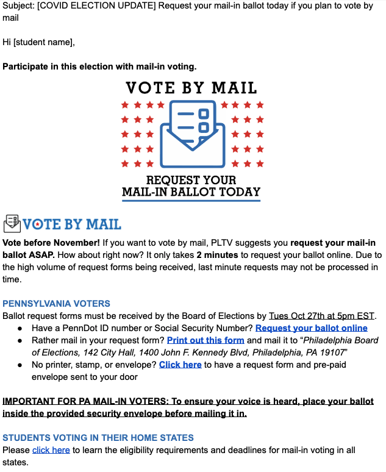
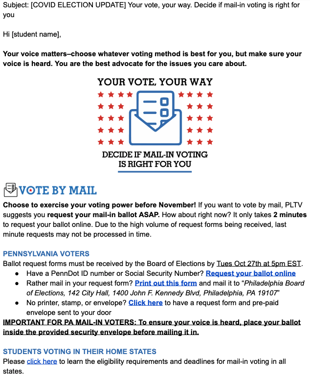

```{r setup, include=FALSE}
options(htmltools.dir.version = FALSE)
knitr::opts_chunk$set(warning = FALSE, message = FALSE, 
  comment = NA, dpi = 300,
  fig.align = "center", out.width = "80%", cache = FALSE)

if(!require('tidyverse')) {
	install.packages('tidyverse')
}
if(!require('devtools')) {
	install.packages('devtools') 
}
if(!require('emo')) {
	devtools::install_github("hadley/emo")
}
if(!require('xaringanExtra')) {
	devtools::install_github("gadenbuie/xaringanExtra")
}
if(!require('countdown')) {
	devtools::install_github("gadenbuie/countdown")
}
```

## Assignment check-in

### Outcome

* What is our research question for the message framing experiment?

--

* How will we operationalize it?

--

* What's our hypothesis?

--

* Ethical considerations?

--

### Process

* What worked?

--

* What didn't work?

---
class: center, middle

## Goal for this week

Collectively design a message framing experiment<br><br>

---
class: center, middle
## What do we know about experimentation?

```{r, echo = FALSE, eval = FALSE}
countdown::countdown(minutes = 5, seconds = 00)
```

Let's brainstorm in the [Jamboard ](https://jamboard.google.com/d/1iASnxsICB9oHyaCSPYAGAxukEeMkdV-TEeNUnO37l1g/edit?usp=sharing)

---
## Principles of experimentation

--

### Goal

Test a causal hypothesis by manipulating one variable and observing change in another variable

--

### Key elements

```{r xaringan-editable1, echo=FALSE}
xaringanExtra::use_editable(expires = 1)
```

.can-edit.key-likes[
* Isolation of the "active" ingredient
* Experimental treatment/manipulation
* Independent variable
* Dependent variable
* Random assignment
]

---
## Critique

Use the [Jamboard ](https://jamboard.google.com/d/1iASnxsICB9oHyaCSPYAGAxukEeMkdV-TEeNUnO37l1g/edit?usp=sharing) to share your observations.

.pull-left[
**Control**


]

.pull-right[
**Autonomy**


]

---
## Design considerations
```{r xaringan-editable2, echo=FALSE}
xaringanExtra::use_editable(expires = 1)
```

.can-edit.key-likes[
* Who are we sampling?
* Within or between-person experimental manipulation?
* What is an appropriate control?
* How strong is the experimental manipulation?
]

---
## Assignment
Design a message framing experiment based on our research question.

These emails will be sent to partner organizations on **April 19**.

--

1. Form drafting and feedback teams

--

2. Drafting team: Copy the control email text and modify the message framing by **March 19**

--

3. Feedback team: Provide feedback on the drafting team's text by **March 26**

--

4. Randomly assign students to receive the experimental or control email

